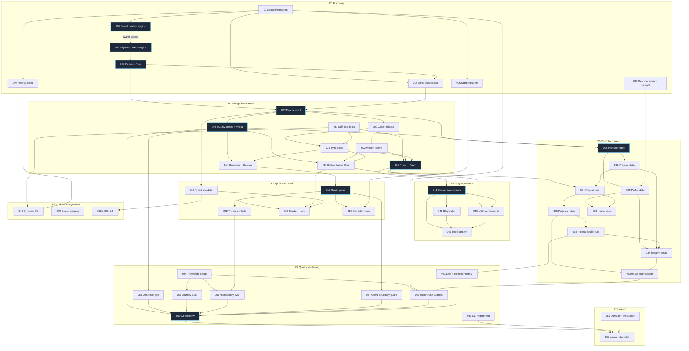

## Sequencing principle

High-risk architecture is settled before anything expensive depends on it. Phase P0 selects and installs a maintained content engine, decomposes Pliny into focused replacements, verifies the new pipeline on clean and deployed builds, tests Open Graph images with self-hosted fonts, measures the starfield performance budget, and measures strict mode against the resulting target stack.

After P0, the ordering follows genuine dependency rather than convenience. Design tokens precede components. Components precede pages. The shell precedes the pages it contains. Content structure precedes content entry. Quality gates come after there is something to gate, but the _scripts_ they depend on land in P1 so nothing is retrofitted.

Content entry, visual refinement, integrations, and infrastructure are deliberately separated from core functionality, so that a stalled content decision never blocks a build task, and a failing third-party integration never blocks launch.

Before P0 or any `git init`, execute `SINGULARITY-032` as a privacy preflight. Its numeric placement reflects the resume feature area, not its execution order. No other task may copy content from the unredacted source PDF.

## Phase P0: Discovery and de-risking

Answer the questions that could invalidate the plan and complete the mandatory dependency migration before design work begins.

Entry criteria:

- This planning set is reviewed and the locked decisions in [README.md](README.md) are accepted.
- A clean checkout builds, or its failure mode is documented.

Exit criteria:

- The owner has selected Velite or Content Collections from a recorded comparison; Content Collections is the recommendation and Contentlayer2 retention is not an option.
- The selected engine passes clean local, degraded-export, watch-mode, and Vercel preview checks.
- `contentlayer2`, `next-contentlayer2`, `pliny`, their aliases, and their imports are absent from source, package metadata, and the lockfile.
- Search, comments, analytics, MDX rendering, content helpers, date formatting, RSS escaping, and newsletter removal have explicit replacements or deletion evidence.
- Dynamic Open Graph image generation is demonstrated with a self-hosted font, or the fallback is chosen.
- A starfield prototype has measured frame cost on a throttled profile against the 2 millisecond budget.
- The TypeScript strict-mode error count is known and categorized against the migrated stack.
- Baseline Lighthouse and bundle numbers are recorded for later comparison.

Gate: `SINGULARITY-002`, `SINGULARITY-003`, and `SINGULARITY-069` are mandatory in order. P1 does not start until the owner selects an engine, the replacement pipeline passes, and a repository-wide scan proves that Contentlayer and Pliny are gone. Failure blocks the program; it does not reactivate either legacy dependency.

Tasks: `SINGULARITY-001` through `SINGULARITY-006`, then `SINGULARITY-069`. The late identifier preserves stable numbering; its execution order is defined by dependencies.

## Phase P1: Design foundations

Establish the token layer, the type system posture, and the primitives. Nothing user-visible changes much, which is intentional. This phase is the substrate.

Entry criteria:

- P0 exit criteria met.
- The owner-selected Velite or Content Collections pipeline is the only content engine installed.
- Pliny has been removed and its replacements pass focused tests.

Exit criteria:

- `yarn typecheck` passes with `strict: true` and zero errors.
- `yarn lint`, `yarn typecheck`, `yarn format:check`, and `yarn test` invoke real tools and all pass; no placeholder success scripts or `--passWithNoTests` flags exist.
- The observatory colour ramps are defined in [css/tailwind.css](../../../css/tailwind.css) and every required contrast pairing is verified with recorded numbers.
- Fonts are self-hosted, subsetted, within the 120 KB budget, and produce no measurable layout shift on swap.
- `Container`, `Section`, `Button`, `Badge`, `Card`, and `Prose` primitives exist with unit tests.
- The global reduced-motion rule is in place and verified in both themes.

Gate: no page work begins until `Prose` renders an existing post correctly in both themes. Typography is the hardest thing to retrofit.

Tasks: `SINGULARITY-007` through `SINGULARITY-017`.

## Phase P2: Application shell

Build the frame that every page sits inside.

Entry criteria:

- P1 exit criteria met.
- Primitives are stable enough that pages can consume them without churn.

Exit criteria:

- Every page renders inside `app/(site)/layout.tsx` and the root layout owns only the document, fonts, theme, and analytics.
- Header, mobile navigation, and footer are rebuilt against the new design system.
- A skip link is the first focusable element on every route, and landmarks are correct.
- Site metadata is typed TypeScript with every placeholder value replaced.
- The P0 newsletter deletion remains complete and the build has no references to it.
- The starfield is mounted, honours reduced motion, is absent below the medium breakpoint, and adds no more than 8 KB gzipped.
- The client component list matches the eleven entries permitted in [architecture.md](architecture.md).

Gate: keyboard-only navigation of the shell works end to end, verified manually, before content pages are built on top of it.

Tasks: `SINGULARITY-018` through `SINGULARITY-027`.

## Phase P3: Portfolio content

The phase that makes this a portfolio. Structure first, then entry, then presentation.

Entry criteria:

- P2 exit criteria met.
- `SINGULARITY-032` completed before repository initialization, or its history assessment is resolved.
- The resume extraction in [research.md](research.md) is confirmed accurate by Matthew.
- `OQ-1`, on publishable detail from the MPBSDP role, is resolved.

Exit criteria:

- Portfolio types compile under strict mode and every field is exercised by real data.
- Profile, skills, education, awards, experience, and project data are populated from the resume.
- The phone number appears nowhere in the repository working tree, in `data/`, or in the published PDF, and the Git history question is resolved.
- `/resume`, `/projects`, `/projects/[slug]`, `/about`, and `/uses` all render and are statically generated.
- The home page leads with identity and selected work, and the positioning statement is present in the server-rendered HTML.
- At least one project has a full case study.

Gate: the sixty-second screen journey, J1, is walked manually on a throttled mobile profile and passes.

Tasks: `SINGULARITY-028` through `SINGULARITY-040`.

## Phase P4: Blog experience

Consolidate and elevate the writing surface.

Entry criteria:

- P3 exit criteria met, or at minimum the `Prose` primitive and shell are frozen.

Exit criteria:

- One post layout serves all three former variants and every existing frontmatter value still resolves.
- The eleven starter posts are deleted, an authoring template exists, and one real seed post is published.
- The table of contents renders as a sticky sidebar above the large breakpoint and as a disclosure below it, and is omitted for posts with fewer than three headings.
- The blog list search filter announces result counts through a polite live region.
- Code, mathematics, citations, figures, and callouts all render correctly in both themes.

Gate: the reader journey, J3, passes with zero layout shift after first paint.

Tasks: `SINGULARITY-041` through `SINGULARITY-047`.

## Phase P5: Optional integrations

Everything here is cuttable. None of it blocks launch.

Entry criteria:

- P2 exit criteria met. P5 may run in parallel with P4.

Exit criteria, per task rather than per phase, because tasks are independent:

- Dynamic Open Graph images render for posts and projects, or the static banner remains and the task is withdrawn.
- Giscus loads only on blog posts, only after a click, and matches the site theme.
- Umami collects page views with no custom events and no cookies.
- The `cmdk` dialog opens, MiniSearch ranks the generated local index, and the complete search surface is styled to the new tokens.
- JSON-LD covers `Person`, `WebSite`, `BlogPosting`, and `BreadcrumbList` and validates.

Gate: none. Each task ships or is withdrawn independently.

Tasks: `SINGULARITY-048` through `SINGULARITY-052`.

## Phase P6: Quality hardening

Install the floor the starter never had.

Entry criteria:

- P4 exit criteria met.
- All routes exist, so tests have stable targets.

Exit criteria:

- The Vitest foundation installed in P1 runs expanded unit tests over `lib/` and the primitives, with meaningful assertions rather than snapshots.
- Playwright covers journeys J1 through J5, one spec per journey.
- Playwright keeps no more than four reviewed screenshots for stable, journey-critical regions.
- Axe reports zero serious or critical violations on every route in both themes.
- The client-boundary guard fails continuous integration when an unlisted file gains `'use client'`.
- Lighthouse CI enforces every budget listed in [README.md](README.md) and fails the build on regression.
- The continuous integration workflow runs lint, typecheck, format check, unit tests, build, end-to-end tests, and Lighthouse on every pull request.
- The production Content Security Policy is tightened per [architecture.md](architecture.md) and verified against a real deployment.
- The internal link checker passes with zero broken links.

Gate: every budget in [README.md](README.md) is green in continuous integration, not just locally.

Tasks: `SINGULARITY-053` through `SINGULARITY-062`.

## Phase P7: Launch readiness

Entry criteria:

- P6 exit criteria met.
- Domain decision resolved, tracked as `OQ-2`.

Exit criteria:

- Favicons, web manifest, and theme colours match the new identity.
- Sitemap, robots, and RSS include every route and exclude drafts.
- The production domain resolves over HTTPS with correct canonical URLs and no `BASE_PATH` artifacts.
- Every asset on the site has a verified licence and, where required, attribution.
- The MIT notice from the upstream starter is retained and credited.
- A rollback procedure is documented and tested once.

Gate: a full manual pass of J1 through J5 on a real phone, on a real network, in both themes.

Tasks: `SINGULARITY-063` through `SINGULARITY-068`.

## Dependency table

Only blocking dependencies are listed. A task with no entry depends solely on its phase gate.

| Task            | Depends on                        | Unlocks                      | Parallel-safe          |
| --------------- | --------------------------------- | ---------------------------- | ---------------------- |
| SINGULARITY-001 | none                              | 002, 004, 005, 058           | Yes                    |
| SINGULARITY-002 | 001                               | 003                          | No, owner-choice gate  |
| SINGULARITY-003 | 002                               | 069                          | No, migration gate     |
| SINGULARITY-004 | 001                               | 048                          | Yes                    |
| SINGULARITY-005 | 001                               | 026                          | Yes                    |
| SINGULARITY-006 | 001, 069                          | 007                          | No                     |
| SINGULARITY-007 | 006, 069                          | 008, all typed work          | No, gating             |
| SINGULARITY-008 | 007                               | 014, 015, 020, 028, 053, 059 | Yes                    |
| SINGULARITY-009 | 007                               | 012, 013, 015, 016           | Yes                    |
| SINGULARITY-010 | none                              | 011                          | Yes                    |
| SINGULARITY-011 | 010                               | 013, 016, 048                | No                     |
| SINGULARITY-012 | 009                               | 015, 016                     | Yes                    |
| SINGULARITY-013 | 009, 011                          | 014, 015, 016                | No                     |
| SINGULARITY-014 | 008, 013                          | 018, 023, 035                | No                     |
| SINGULARITY-015 | 008, 012, 013                     | 023, 034, 038                | No                     |
| SINGULARITY-016 | 011, 012, 013                     | 041, 046                     | No, gating for P4      |
| SINGULARITY-017 | 009                               | 026                          | Yes                    |
| SINGULARITY-018 | 014                               | 019 to 027, all page work    | No, gating             |
| SINGULARITY-019 | 018                               | none                         | Yes                    |
| SINGULARITY-020 | 007, 008                          | 021, 023, 025, 052           | No                     |
| SINGULARITY-021 | 069                               | none                         | Withdrawn              |
| SINGULARITY-022 | 018                               | 056                          | Yes                    |
| SINGULARITY-023 | 014, 015, 020                     | 024                          | No                     |
| SINGULARITY-024 | 023                               | none                         | Yes                    |
| SINGULARITY-025 | 020                               | 066                          | Yes                    |
| SINGULARITY-026 | 005, 017, 018                     | none                         | Yes                    |
| SINGULARITY-027 | 018                               | none                         | Yes                    |
| SINGULARITY-028 | 007, 008                          | 029 to 040                   | No, gating for P3      |
| SINGULARITY-029 | 028, 032                          | 038, 039                     | Yes                    |
| SINGULARITY-030 | 028                               | 038, 039                     | Yes                    |
| SINGULARITY-031 | 028                               | 034, 035, 038                | Yes                    |
| SINGULARITY-032 | none; execute before P0           | 029, 033, 037                | No, privacy preflight  |
| SINGULARITY-033 | 032                               | none                         | No                     |
| SINGULARITY-034 | 015, 031                          | 035, 038                     | No                     |
| SINGULARITY-035 | 034                               | 036                          | No                     |
| SINGULARITY-036 | 035                               | 037                          | No                     |
| SINGULARITY-037 | 029, 031, 032, 036                | none                         | No, gating for P3 exit |
| SINGULARITY-038 | 029, 030, 034                     | none                         | No                     |
| SINGULARITY-039 | 029, 030                          | none                         | Yes                    |
| SINGULARITY-040 | 018                               | none                         | Yes                    |
| SINGULARITY-041 | 016                               | 042 to 047                   | No, gating for P4      |
| SINGULARITY-042 | 041                               | 043, 047                     | Yes                    |
| SINGULARITY-043 | 041                               | none                         | Yes                    |
| SINGULARITY-044 | 015, 041                          | none                         | Yes                    |
| SINGULARITY-045 | 041, 042, 046                     | 051, 061                     | No                     |
| SINGULARITY-046 | 016, 041                          | 045                          | Yes                    |
| SINGULARITY-047 | 042                               | none                         | Yes                    |
| SINGULARITY-048 | 004, 011                          | none                         | Yes                    |
| SINGULARITY-049 | 041, 069                          | none                         | Yes                    |
| SINGULARITY-050 | 020, 069                          | none                         | Yes                    |
| SINGULARITY-051 | 015, 045, 069                     | none                         | Yes                    |
| SINGULARITY-052 | 020, 028                          | none                         | Yes                    |
| SINGULARITY-053 | 008                               | 059                          | Yes                    |
| SINGULARITY-054 | all routes exist                  | 055, 056                     | No                     |
| SINGULARITY-055 | 054                               | 059                          | Yes                    |
| SINGULARITY-056 | 054, 022                          | 059                          | Yes                    |
| SINGULARITY-057 | 018                               | 059                          | Yes                    |
| SINGULARITY-058 | 001, 054, 062                     | 059                          | Yes                    |
| SINGULARITY-059 | 008, 053, 055, 056, 057, 058, 061 | 067                          | No                     |
| SINGULARITY-060 | deployed preview exists           | 067                          | Yes                    |
| SINGULARITY-061 | 036, 045                          | 059                          | Yes                    |
| SINGULARITY-062 | 035, 037                          | 058                          | Yes                    |
| SINGULARITY-063 | 009                               | 067                          | Yes                    |
| SINGULARITY-064 | all routes exist                  | 067                          | Yes                    |
| SINGULARITY-065 | OQ-2 resolved                     | 067                          | No                     |
| SINGULARITY-066 | 025, 031, 037                     | 067                          | No                     |
| SINGULARITY-067 | 059, 060, 063, 064, 065, 066      | 068                          | No                     |
| SINGULARITY-068 | 067                               | none                         | Yes                    |
| SINGULARITY-069 | 003                               | 006, 007, all of P1          | No, migration gate     |

## Dependency graph

Selected blocking dependencies, with the parallel branches that matter. The table above remains authoritative for dependencies omitted to keep the graph legible; every arrow shown below corresponds to a table entry.



Nodes outlined in the gate style block their entire downstream phase. The content-engine selection, content migration, and Pliny removal are sequential gates rather than optional or conditional work.

## Parallelization

Where more than one agent run can proceed simultaneously without conflict.

| Window                | Concurrent tracks                                                                                                       |
| --------------------- | ----------------------------------------------------------------------------------------------------------------------- |
| After SINGULARITY-001 | 002, 004, 005, and 006 all run independently. Four parallel runs.                                                       |
| After SINGULARITY-007 | 009 and 010 on the design track, 008 on the tooling track.                                                              |
| After SINGULARITY-018 | 019, 022, 025, 026, and 027 touch disjoint files. Five parallel runs.                                                   |
| After SINGULARITY-028 | 029, 030, and 031 can run in separate data files after the privacy preflight has completed.                             |
| P4 and P5             | `048` and `050` may overlap P4. `049` waits on `041`, `051` waits on `045`, and `052` waits on portfolio data.          |
| Within P6             | 053, 057, and 060 are independent. `054` precedes `055` and `056`; `062` precedes `058`; `036` and `045` precede `061`. |
| Within P7             | 063, 064, and 066 are independent.                                                                                      |

Conflict warnings. `SINGULARITY-009`, `SINGULARITY-013`, and `SINGULARITY-017` all edit [css/tailwind.css](../../../css/tailwind.css); serialize them. `SINGULARITY-018` moves most page files; nothing else should be in flight during it. `SINGULARITY-041` deletes three layout files; no blog task may run concurrently.

## Validation strategy

### Per-task validation

Every task in [tasks.md](tasks.md) carries its own validation commands. The standard set:

```bash
yarn typecheck        # tsc --noEmit, must be clean under strict
yarn lint             # ESLint flat config, zero errors
yarn format:check     # Prettier, no diffs
yarn test             # Vitest unit tests
yarn build            # Full build including the selected content engine and postbuild
yarn test:e2e         # Playwright, journeys J1-J5
yarn analyze          # Bundle composition against budgets
```

Only `yarn build` and `yarn lint` exist today. The rest are added in `SINGULARITY-008`.

### Layered validation

Automated checks catch regressions. Manual checks catch the things automation is bad at: whether the typography feels right, whether the observatory concept reads as intentional rather than accidental, and whether a stranger understands who Matthew is.

| Layer                | Tool                               | Scope                                            | Runs                                 |
| -------------------- | ---------------------------------- | ------------------------------------------------ | ------------------------------------ |
| Types                | `tsc --noEmit`                     | Whole repository                                 | Pre-commit, continuous integration   |
| Lint                 | ESLint flat config with `jsx-a11y` | `app`, `components`, `layouts`, `lib`, `scripts` | Pre-commit, continuous integration   |
| Format               | Prettier                           | All supported files                              | Pre-commit, continuous integration   |
| Unit                 | Vitest                             | `lib/`, primitives, data validators              | Continuous integration               |
| Accessibility        | `@axe-core/playwright`             | Every route, both themes                         | Continuous integration               |
| End to end           | Playwright                         | Journeys J1 to J5                                | Continuous integration               |
| Performance          | Lighthouse CI                      | Home, a post, a project, resume                  | Continuous integration, on preview   |
| Field responsiveness | Vercel Speed Insights              | Production 75th-percentile INP                   | Post-launch after sufficient samples |
| Bundle               | `@next/bundle-analyzer`            | First-load JavaScript per route                  | Manual, plus a size gate             |
| Links                | `scripts/check-links.mjs`          | Internal links and anchors                       | Continuous integration               |
| Structured data      | Rich Results Test                  | Post, project, about                             | Manual, pre-launch                   |
| Manual               | Checklist below                    | Whole site                                       | Phase gates, pre-launch              |

### Manual checklist

Run at every phase gate. Not automatable, and the automation that claims to cover it does not.

- Tab through the entire page. Focus is always visible, order is logical, nothing is reachable but invisible.
- Set the operating system to reduced motion. Confirm the canvas starfield does not load at all, and that no transition exceeds a perceptible duration.
- Disable JavaScript. Confirm navigation, reading, project browsing, and the resume download all still work.
- Toggle light, dark, and system. Confirm no flash of the wrong theme and no illegible pairing.
- Load on a real phone over a real cellular connection, not a throttled desktop profile.
- Read one post at 200 percent browser zoom. Confirm nothing is clipped and the measure stays readable.
- Ask someone unfamiliar with the site to describe what Matthew does, after sixty seconds on the home page.

That last check is the real acceptance test for the whole project.

### Regression protection

Lighthouse CI assertions fail the build on budget regression rather than reporting a score, which is the difference between a budget and a dashboard. Lighthouse asserts Total Blocking Time; production Interaction to Next Paint comes from Vercel Speed Insights and is reported separately. The client-boundary guard in `SINGULARITY-057` prevents the most likely architectural regression, a well-meaning change that adds `'use client'` to a component high in the tree. `SINGULARITY-061` prevents broken links and broken project-to-MDX relationships after slug changes.
